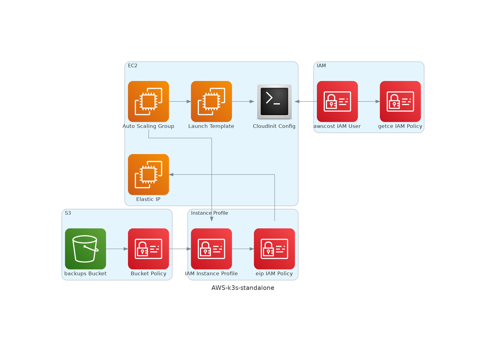

# terraform-aws-k3s-standalone

Diagram of this **terraform module**:

This **terraform module** provides a convenient solution for deploying a standalone instance of **K3S** on a single node within **AWS**. The module utilizes an **ASG** (Auto Scaling Group) for deployment and includes automatic periodic backups to an **S3** bucket. In the event that the instance is terminated, the module also handles the restoration process from the **S3** backup.

This module is used to deploy [pet2cattle](https://pet2cattle.com).